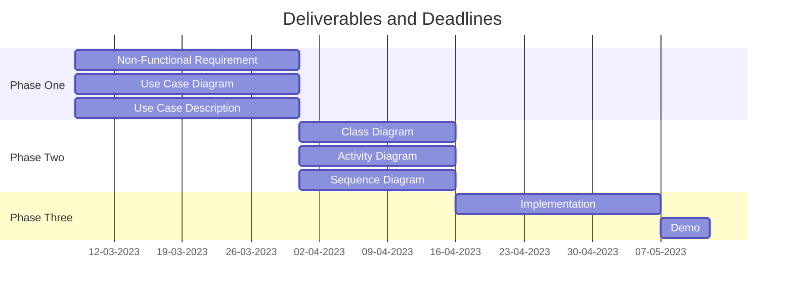

# Project Documents

## Problem Description

link: [problem_description.md](problem_description.md)

## Phases

### Phase One: 25%

- Non-Functional requirement list.
- Use case diagram.
- Use case descreption.

link: [phase_1](phase_1)

### Phase Two: 35%

- Class Diagram of the system.
- Activity Diagram for the main operations from the class diagram.
- Sequence Diagram of the main flows of the system.

link: [phase_2](phase_2)

### Phase Three: 25%

The implemented Code.

### Demo: 15%

15 min demos with the instructor.

## Deliverables and Deadlines

