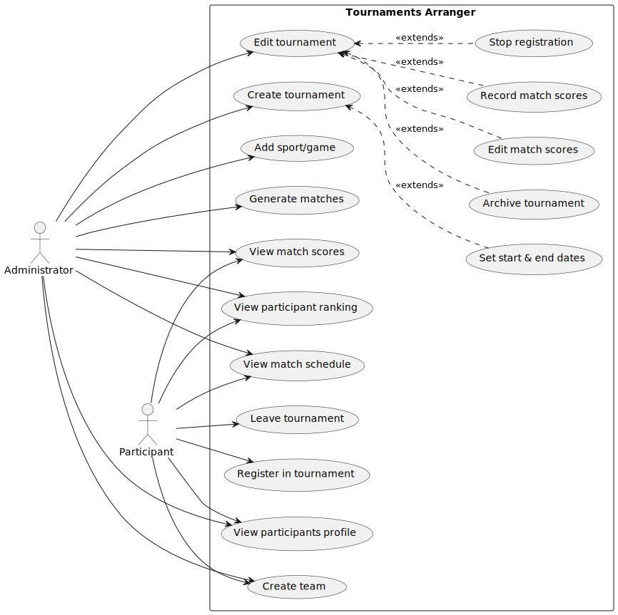

# Phase One

## Requirements

link: [requirements.md](requirements.md)

## Use Case

### Use Case Diagram

svg link: [use_case_diagram.svg](use_case_diagram.svg)

code link: [use_case_diagram.puml](use_case_diagram.puml)

### Use Case Description

link: [use_case_description.md](use_case_description.md)
