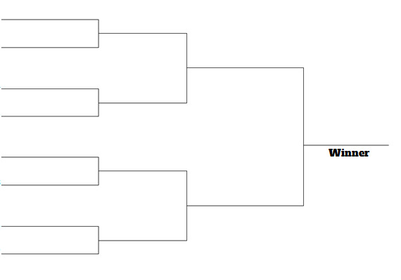
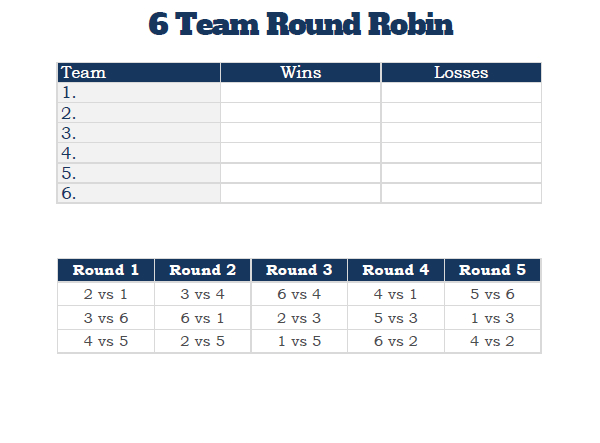

# Project Description

## Document One

Hi, my name is Ahmad from the student activities team at KFUPM. We are part of the student affairs, and we focus on offering extracurricular clubs and programs for the students in campus.

Part of the activities we offer is arranging and managing tournaments for the students in various sports and games with the help of some department like physical education department or some students clubs. Those tournaments might be team based or individual. If it was individuals, we would keep track of the student’s name and his id. If it was a team we have a name for the team, the student forming the team and whatever we track of the student’s info.

The tournament we arrange are of two types:

1. Elimination tournaments:

    We have a pyramid like matches where if a team win, they go to the next stage and if they lose, they are eliminated from the tournament. The winner is the one that win the last match.

    

2. Round robin tournament:

    Each team will play against all other teams over time. If they win against a team they gain 3 points, if they lose they gain 0 points and if draws are possible with those tournaments and it gave both team 1 point. At the end of tournament when each team finished their matches the team at the top of the ranking is the winner of the tournament. In case there was a tie in terms of points between two teams we look into the direct match between those two teams, if their direct match was draw or it was 3-way draw we look the team with highest wins then the team who scored the most goals and received least goals (goals for football, for different games it will differ and won’t be goals).

    

We would like a software that helps us keep track of those tournaments such that we could add the teams and record the scores of the matches, and it will show the table or bracket update live depend on the score we recorded.

Another task we do is after we register the teams who would like to participate, we need to come up with table of matches. This task sometimes is hard and we may influence it with our bias, so we would like a software that could generate the match table for us depends on the tournament type. If it was elimination, it will generate the first round and if it was round robin it will generate all the rounds.

Also, we would like to have individuals’ profiles such that we could know which tournaments a single students participated on even if they participated as part of a team and if where did they place in that tournament if it finished and what is their current ranking if it is still in progress.

This is what our team have in mind. We may send you more features in the future.

> Regards, Ahmad (from the student activities team)

## Document Two

Hi, it is Ahmad again. After I met my team we felt like we need to clarify our needs so this document will clarify our needs.

First for tournament, we record the name of the tournament, they type of it (elimination or round robin) the participation type (teams or individuals) and the sport/game of the tournament. Right now we arrange tournaments for Football, Volleyball, Basketball, Tennis, and some games we arrange with some of the students clubs however we would like to have and easy way to choose the sport/game and a way to add new sports/games.

Also, we set up the start and end dates for the tournaments thus the matches of this tournament should be within the same period. For generating the tables, we would like an option that allow us to specify the number of days between each stage in elimination and rounds if it was round robin. Also as long as the tournament is not done we would like to have the ability to edit the entered data whether it was the team members or even the matches scores. After a tournament is finished, we would like to have it archived in the system where we can access it later on but it is only viewed and shouldn’t be able to edit it. Since we have dates for the matches, we would like to access all matches of all tournaments by day, it could even show today’s matches by default. Once a match date in the past and we didn’t enter the score of the match, we would like the system to highlight it, so we update it urgently.

For the teams, they aren’t fixed teams and they are only created for a single tournament. Say I was part of TeamA in the football tournament, I could be part of TeamZ in the basketball tournament. The only limitation is to have the same student participate in the same tournament twice with different teams. This is what we have in mind. We may send you more features in the future.

> Regards, Ahmad (from the student activities team)

## Document Three

Hi, it is Ahmad again. After I met my team we felt like we have better imagination of what the software is supposed to do.

There will be a computer/tablet near the courts where it shows the previous competitions, current competitions, and the upcoming competitions. We would like the students to register for the upcoming competitions themselves, and they could register through that computer. If the competition was team based, they need to provide details of the team and team members. We would like it such that once they register, they will receive a confirmation email in their student email.

For us admins, we need some sort of authentication and once we are logged in, we would like to have the ability to stop registration for a competition, generate the tables and whatever we mentioned before. In the moment we are in contact with Mr. Abdulmjeed from the ICS department and the ICTC where he will provide us with a way to authenticate the students. According to him, if the ICTC don’t provide a way to authenticate the students he will create an API or another way for our application to authenticate the students. We will update it whenever Mr. Abdulmjeed response to us.

> Regards, Ahmad (from the student activities team)
